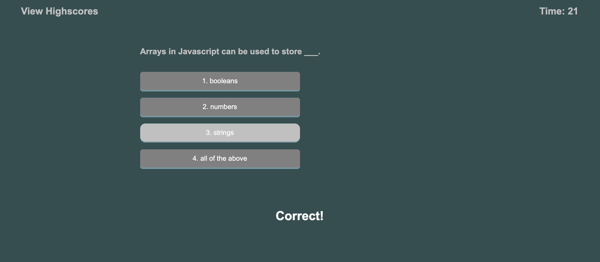

# Code Quiz

## Description
Create a timed quiz on Javascript that stores highscores

## Criteria
- A timer begins and questions appear when the start button is clicked
- When a question is answered incorrectly, time is subtracted from the clock
- Save initials to score and added to Highscore list

## Screenshot

## Deployed Page
https://chindatrate.github.io/code-quiz/

## GitHub Repository
https://github.com/chindatrate/code-quiz